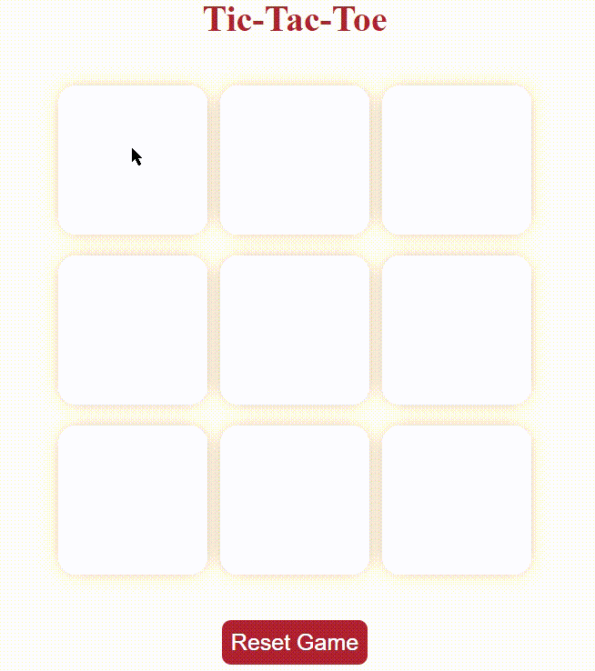

# Tic-Tac-Toe Interactive Web Game

A fun and interactive Tic-Tac-Toe game built using HTML, CSS, and JavaScript. Play against a friend in your browser with a visually appealing and responsive design.

## Features

- **Interactive Gameplay:** Click to place X or O, alternating turns automatically.
- **Win & Draw Detection:** Instantly displays the winner or declares a draw when the game ends.
- **Responsive UI:** Clean, modern layout that works on desktop and mobile.
- **Game Controls:** "New Game" and "Reset Game" buttons to quickly restart or reset the board.

## Live Demo

<!--  -->

- Link to the Game:- 
    [Click here to play](https://amritv0306.github.io/Tic-Tac-Toe/)

## How to Play

1. Open `index.html` in your web browser.
2. Player X starts the game. Click any empty box to make a move.
3. Players take turns. The first to align three marks (horizontally, vertically, or diagonally) wins.
4. If all boxes are filled without a winner, the game declares a draw.
5. Use **New Game** or **Reset Game** to start over at any time.

## Project Structure

| File         | Description                                  |
|--------------|----------------------------------------------|
| `index.html` | Main HTML structure for the game board       |
| `style.css`  | Styling for layout, colors, and buttons      |
| `script.js`  | Game logic: turns, win/draw, controls        |

## How to Run Locally

1. Download or clone this repository.
2. Ensure all files (`index.html`, `style.css`, `script.js`) are in the same directory.
3. Open `index.html` with any modern web browser.

## Customization

- **Colors & Styles:** Edit `style.css` to change the appearance.
- **Game Logic:** Enhance `script.js` to add features like score tracking or AI.

## Credits

Made by **Amrit Verma**.  
Feel free to use, modify, or share!

## License

This project is open-source and free to use.

Enjoy playing!
